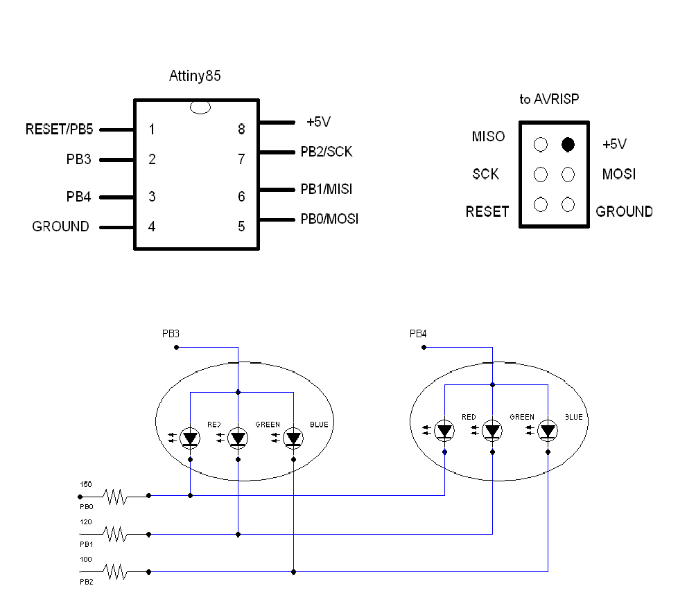
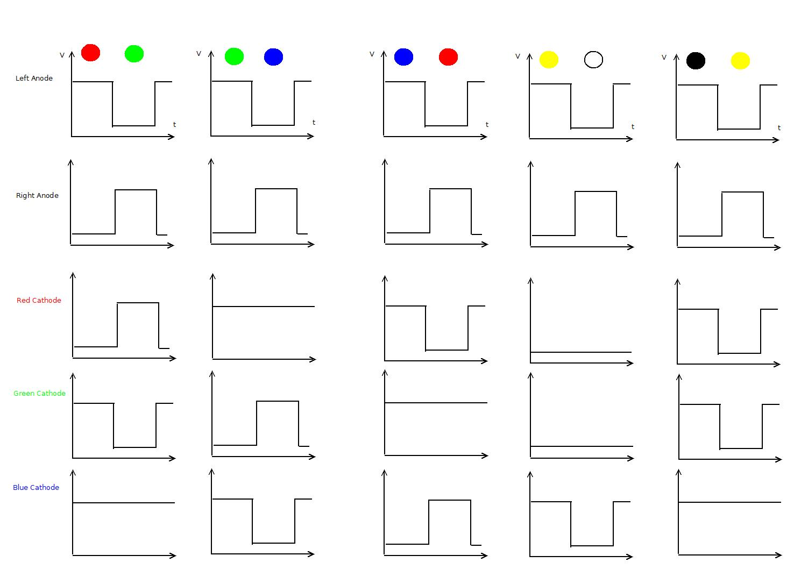

# Pumpkin

This project is about controlling two 10mm three-color common anode LEDs with Attiny85 chip. 
Project program uses Adam Dunkels Protothreads library and you can see this program as illustration of  how
to use protothreads: small but efficient C framework. (I am in no way affiliated with Adam Dunkels apart of to be 
user of his library). 
LED represents two multicolored eyes of Pumpkin Halloween Glitter.
# Circut 

Design uses five chip pins: 
* Two pins used to control anodes:  each LED anode attached to the dedicated pin.
* Three pinns attached (throuhg resistors) to LEDs cathodes (the same color cathode of each led attached to the same pin);

Note. Design can't use all six in/out pins because pin PB5 (RESET) is
a weak pin capable to provide just ~2 mA of the current, while there is need to have ~20 mA.
# Timing diagram

Top two rows on diagram shows voltage change on LED anodes. Voltage on pins connected to LED anodes oscillate with frequency ~ 250 Hz.  This voltage oscillation on anode for left eye is an opposite to the oscillation on right eye. When voltage on anode is high corresponding LED may be lighted. When it is  low corresponding LED is dark. That means each LED is dark during 2 milliseconds interval and may be bright during another 2 milliseconds. Because human eye has some inertia, 250 Hz blinking is not noticeable by observer.
Bottom three rows on diagram shows change of voltage on pins connected to LEDs cathodes when lighting up LEDs in various  colors. Let us look for example on the first diagram column. It shows the case when left LED is in red color and right LED in green color. Here RED cathodes stays low while left anode is high, GREEN cathode stays low while right anode is high, and BLUE cathode stays low all time. Other columns on diagram shows combinations of cathode and anode voltage for various colors.
# Programming
This section  contains highlights regarding protothreads usage.
## Main Loop
``` C

int main(void) {
	initialize();
	struct pt lpt; // protothread descriptor: left
	struct pt rpt; // protothread descriptor: right
	PT_INIT(&lpt);
	PT_INIT(&rpt);
	int16_t li = 0; // function counter: left
	int16_t ri = 0; // function counter: right
	for(;;) { // main loop
		LeftEye(&lpt, &li);
		_delay_ms(TIME_INTERVAL); 
		RightEye(&rpt, &ri);
		_delay_ms(TIME_INTERVAL); 		
	}
}
```

## Auxiliary functions

## Protothreads routings
